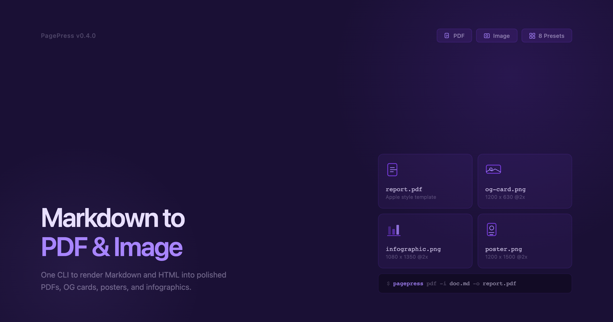
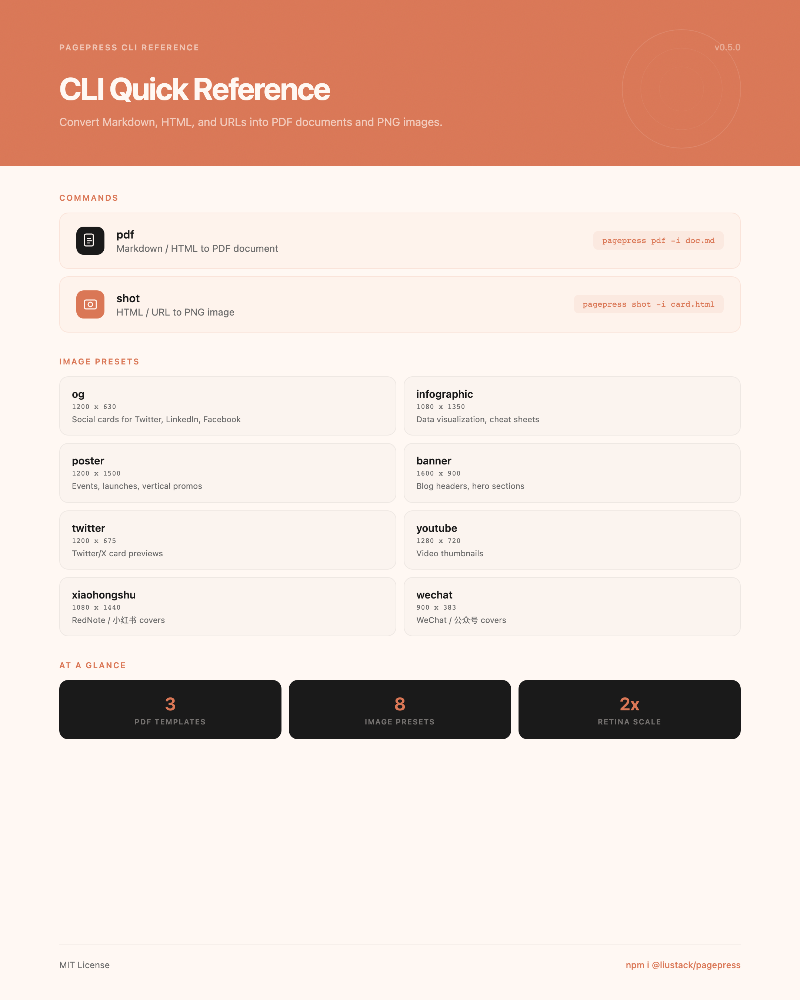
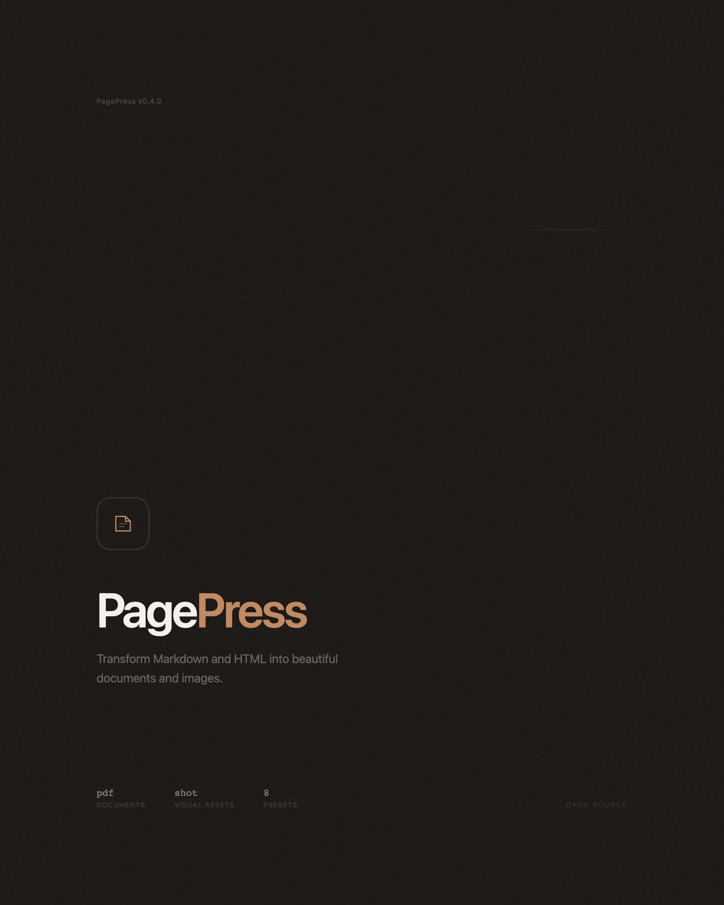
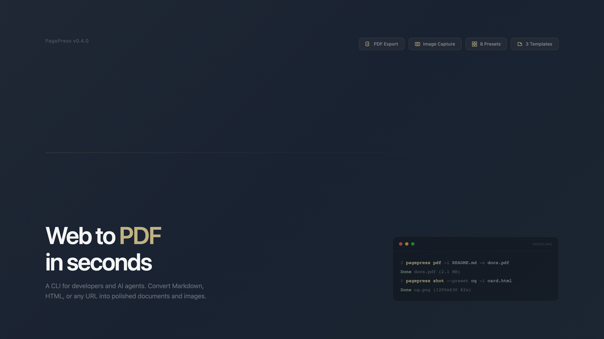
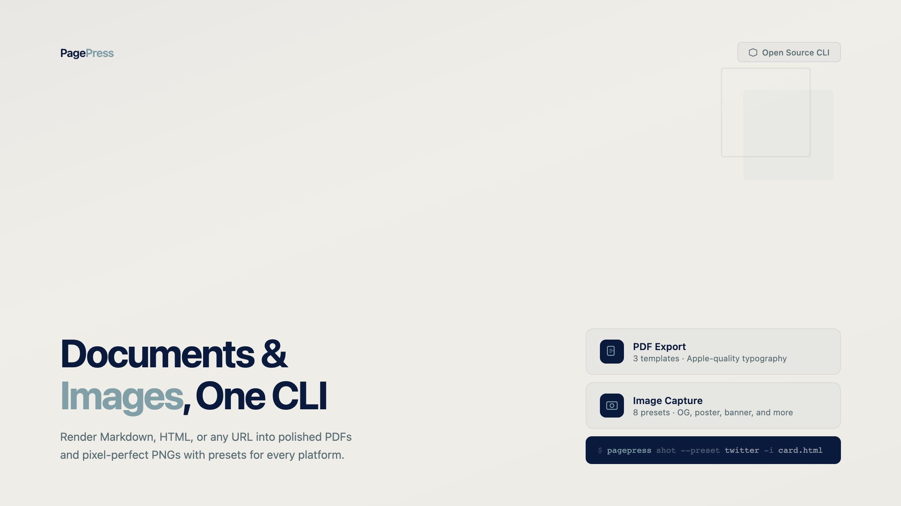
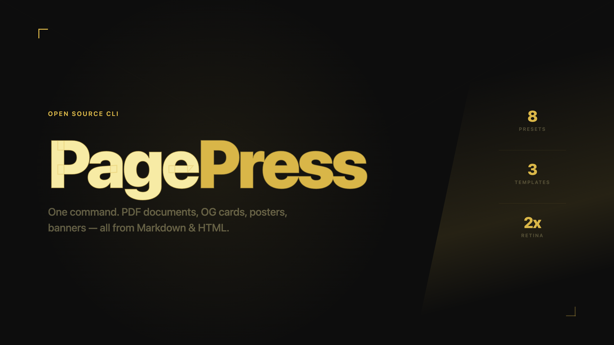
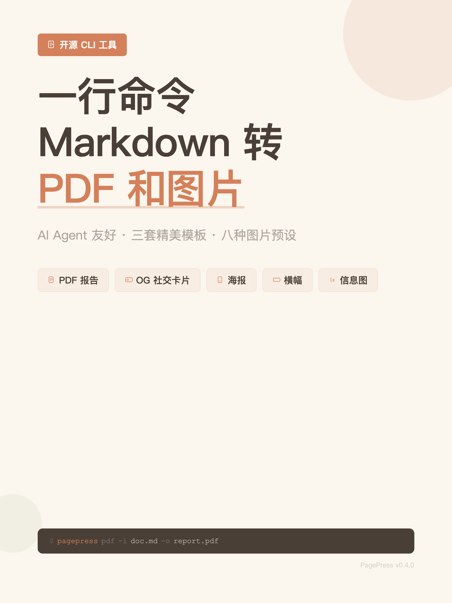
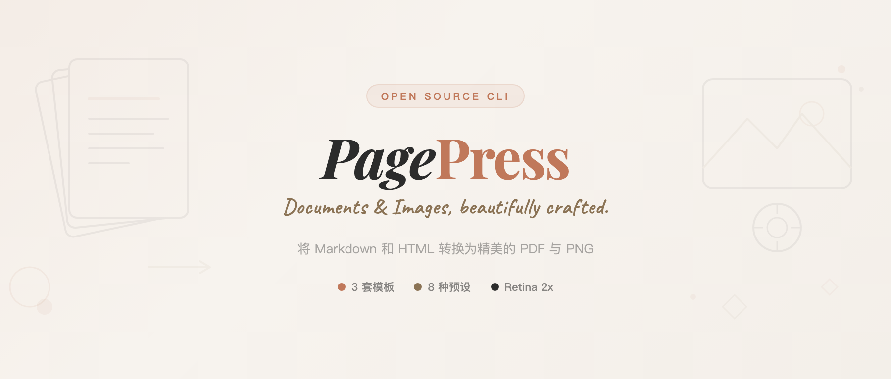

# PagePress

一套专为 **AI Agent** 设计的 Web 内容渲染工具集（CLI），可将本地 HTML、Markdown 文件转换为高质量的 **PDF** 或 **PNG** 图像。

## ✨ 特性

- **统一 CLI**：一个工具 (`pagepress`) 搞定 PDF 和 Image 生成
- **AI Agent 友好**：包含详细的 SKILL.md 指南，支持场景路由
- **仅本地文件**：支持本地 HTML、Markdown 文件（出于安全考虑不支持远程 URL）
- **丰富模板**：
  - **PDF**: Apple 风格、GitHub 风格、杂志排版 (Magazine)
  - **Image**: 8 种预设 — OG 卡片、信息图、海报、横幅、Twitter/X 卡片、YouTube 缩略图、小红书封面、微信公众号封面
- **品牌一致性**：OG/海报/横幅会基于工作区的视觉与品牌资源生成（常见于 `assets/`、`public/`、`src/assets/`）
- **一致性保障**：确定性渲染、字体等待、网络空闲检测、代码高亮

## 📦 安装

```bash
# 全局安装
npm install -g @liustack/pagepress

# 安装浏览器（Playwright）
npx playwright install chromium
```

或者直接使用 `npx`:

```bash
npx @liustack/pagepress <command> [options]
```

## 🚀 使用指南

### 1. 生成 PDF

将 HTML/Markdown 转换为 PDF 文档。支持代码高亮。

```bash
# Markdown 转 PDF（使用 Apple 风格模板）
pagepress pdf -i document.md -o output.pdf --template default

# 本地 HTML 文件转 PDF
pagepress pdf -i page.html -o output.pdf

```

**支持的模板**：
- `default` - Apple 风格，简洁优雅
- `github` - GitHub 风格
- `magazine` - VOGUE/WIRED 杂志排版

### 2. 生成图像

将本地 HTML 渲染为 PNG 图像，适合社交分享卡片、海报、信息图。

对于 OG 卡片、海报、横幅，视觉应基于工作区的品牌资源（logo、颜色、字体、素材）生成，常见目录包括 `assets/`、`public/`、`src/assets/`。

**品牌资源目录建议**：

```text
assets/
  brand/
    logo.svg
    palette.json
    fonts/
      YourBrand-Regular.woff2
    imagery/
      hero.jpg
```

```bash
# 生成 OG 卡片（1200×630）
pagepress shot -i card.html -o og.png --preset og

# 生成信息长图
pagepress shot -i stats.html -o infographic.png --preset infographic

```

**支持的预设**：
- `og` (1200×630) - 社交卡片
- `infographic` (1080×1350) - 信息图
- `poster` (1200×1500) - 海报
- `banner` (1600×900) - 横幅
- `twitter` (1200×675) - Twitter/X 卡片
- `youtube` (1280×720) - YouTube 缩略图
- `xiaohongshu` (1080×1440) - 小红书封面
- `wechat` (900×383) - 微信公众号封面

## 🖼️ 示例

### 图像预设

| OG 卡片 (1200×630) | 信息图 (1080×1350) |
|:---:|:---:|
|  |  |

| 海报 (1200×1500) | 横幅 (1600×900) |
|:---:|:---:|
|  |  |

| Twitter/X 卡片 (1200×675) | YouTube 缩略图 (1280×720) |
|:---:|:---:|
|  |  |

| 小红书封面 (1080×1440) | 微信公众号封面 (900×383) |
|:---:|:---:|
|  |  |

## 🤖 AI Agent 集成

本项目包含两份 AI Agent 技能指南（适用于 Claude、ChatGPT 等）：

- [web-to-pdf/SKILL.md](skills/web-to-pdf/SKILL.md) — PDF 生成（Markdown 美化、模板、HTML 打印）
- [web-to-png/SKILL.md](skills/web-to-png/SKILL.md) — PNG 生成（OG 卡片、信息图、海报、横幅、社交卡片）

Agent 可以根据用户的自然语言指令（如"生成一张海报"、"把这个文档转成 PDF"）自动选择合适的命令和参数。

## 📄 License

MIT
