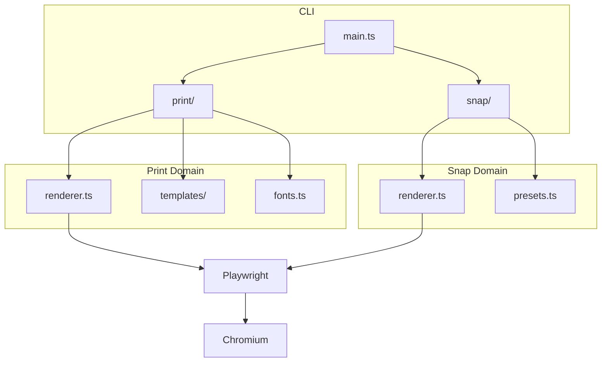

# PagePress

> **一行命令，无限可能。** 将 Markdown 和 HTML 转化为精美的 PDF 和图像。

---

## 为什么选择 PagePress？

在这个 AI 驱动的时代，**内容生成**已不再是瓶颈。真正的挑战在于：如何将这些内容**高效、优雅地呈现**给世界。

PagePress 正是为此而生：

- **开发者友好** — 纯 CLI，一行代码搞定
- **AI Agent 就绪** — 内置场景路由，智能选择输出格式
- **设计即代码** — Apple 风格模板，所见即所得

```bash
# 一键生成 PDF
pagepress print -i README.md -o doc.pdf --template magazine

# 快照 OG 图像
pagepress snap -i card.html -o og.png --preset og
```

---

## 核心能力

### 1. Markdown → PDF

支持完整的 Markdown 语法 + 扩展特性：

| 特性 | 支持情况 | 说明 |
|------|:--------:|------|
| 标题层级 | ✅ | H1 ~ H6 全支持 |
| 代码高亮 | ✅ | 40+ 语言自动识别 |
| **Mermaid 图表** | ✅ | 内置渲染，无需预处理 |
| 表格 | ✅ | GitHub 风格 |
| 引用块 | ✅ | 支持嵌套 |
| 列表 | ✅ | 有序、无序、任务列表 |

### 2. HTML/URL → PNG

社交卡片、信息图、海报、横幅——一个命令全搞定：

- `--preset og` — 1200×630 社交预览图
- `--preset infographic` — 1080×1350 信息长图
- `--preset poster` — 1200×1500 活动海报
- `--preset banner` — 1600×900 博客封面

---

## 代码高亮演示

### TypeScript

```typescript
interface PagePressOptions {
  input: string;
  output: string;
  template?: 'default' | 'github' | 'magazine';
}

async function render(options: PagePressOptions): Promise<void> {
  const { input, output, template = 'default' } = options;
  
  // 魔法发生在这里 ✨
  await chromium.launch({ headless: true });
  console.log(`Generated: ${output}`);
}
```

### Python

```python
from pagepress import render

# 简洁的 API 设计
result = render(
    input="report.md",
    output="report.pdf",
    template="magazine"
)

print(f"✅ PDF 已生成: {result.path}")
```

---

## 架构设计

PagePress 采用 **Domain 驱动** 的代码组织方式：



### 技术栈

1. **Playwright** — 无头浏览器渲染引擎
2. **Marked** — Markdown 解析器
3. **Highlight.js** — 代码语法高亮
4. **Mermaid** — 流程图渲染
5. **Fontsource** — 本地字体注入

---

## 设计哲学

> *"Less is more."* — Mies van der Rohe

我们相信优秀的工具应该是**隐形的**。你不需要学习复杂的配置，不需要安装一堆依赖，只需：

```bash
pagepress print -i your-doc.md -o output.pdf
```

**就这样。** 剩下的交给 PagePress。

---

## 快速开始

### 安装

```bash
npm install -g pagepress
npx playwright install chromium
```

### 使用

```bash
# PDF 生成
pagepress print -i document.md -o output.pdf

# 图像快照
pagepress snap -i card.html -o image.png --preset og
```

---

## 模板预览

### Default — Apple 风格

简洁、优雅、留白充足。适合技术文档和博客文章。

### GitHub — 开发者熟悉的样式

与 GitHub README 保持一致的视觉体验。

### Magazine — 杂志排版

VOGUE/WIRED 风格的高端排版，适合营销材料和产品手册。

---

## 未来路线图

- [ ] 自定义主题 API
- [ ] 目录自动生成
- [ ] 水印支持
- [ ] 批量处理模式
- [ ] Web UI 可视化编辑器

---

## 开源协议

MIT License © 2024 Leon Liu

**GitHub**: [github.com/liustack/pagepress](https://github.com/liustack/pagepress)

---

*用 PagePress 生成 · 设计即代码*
