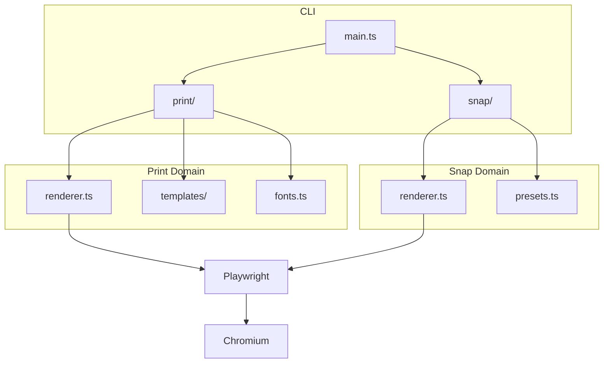

# PagePress

> **One command, infinite possibilities.** Turn Markdown and HTML into beautiful PDFs and images.

---

## Why Choose PagePress?

In this AI-driven era, **content generation** is no longer the bottleneck. The real challenge is how to present that content **efficiently and elegantly** to the world.

PagePress was built for exactly that:

- **Developer friendly** - pure CLI, one command does it all
- **AI Agent ready** - built-in scenario routing, smart output selection
- **Design is code** - Apple-style templates, WYSIWYG

```bash
# Generate a PDF in one command
pagepress print -i README.md -o doc.pdf --template magazine

# Snapshot an OG image
pagepress snap -i card.html -o og.png --preset og
```

---

## Core Capabilities

### 1. Markdown -> PDF

Supports full Markdown syntax plus extended features:

| Feature | Support | Notes |
|---------|:-------:|-------|
| Headings | ✅ | Full H1-H6 support |
| Syntax highlighting | ✅ | 40+ languages auto-detected |
| **Mermaid diagrams** | ✅ | Built-in rendering, no preprocessing |
| Tables | ✅ | GitHub style |
| Blockquotes | ✅ | Nested support |
| Lists | ✅ | Ordered, unordered, task lists |

### 2. HTML/URL -> PNG

Social cards, infographics, posters, banners - all done with one command:

- `--preset og` - 1200x630 social preview image
- `--preset infographic` - 1080x1350 infographic
- `--preset poster` - 1200x1500 event poster
- `--preset banner` - 1600x900 blog cover

---

## Syntax Highlighting Demo

### TypeScript

```typescript
interface PagePressOptions {
  input: string;
  output: string;
  template?: 'default' | 'github' | 'magazine';
}

async function render(options: PagePressOptions): Promise<void> {
  const { input, output, template = 'default' } = options;

  // Magic happens here ✨
  await chromium.launch({ headless: true });
  console.log(`Generated: ${output}`);
}
```

### Python

```python
from pagepress import render

# Clean API design
result = render(
    input="report.md",
    output="report.pdf",
    template="magazine"
)

print(f"✅ PDF generated: {result.path}")
```

---

## Architecture

PagePress uses a **domain-driven** code organization:



### Tech Stack

1. **Playwright** - headless browser rendering engine
2. **Marked** - Markdown parser
3. **Highlight.js** - code syntax highlighting
4. **Mermaid** - diagram rendering
5. **Fontsource** - local font injection

---

## Design Philosophy

> *"Less is more."* - Mies van der Rohe

We believe great tools should be **invisible**. You do not need to learn complex configuration or install a pile of dependencies. Just:

```bash
pagepress print -i your-doc.md -o output.pdf
```

**That's it.** Leave the rest to PagePress.

---

## Quick Start

### Installation

```bash
npm install -g pagepress
npx playwright install chromium
```

### Usage

```bash
# PDF generation
pagepress print -i document.md -o output.pdf

# Image snapshot
pagepress snap -i card.html -o image.png --preset og
```

---

## Template Preview

### Default - Apple Style

Clean, elegant, and spacious. Great for technical docs and blog posts.

### GitHub - Familiar Developer Style

A visual experience consistent with GitHub README.

### Magazine - Editorial Layout

VOGUE/WIRED-inspired premium layout, suitable for marketing materials and product brochures.

---

## Roadmap

- [ ] Custom theme API
- [ ] Automatic table of contents generation
- [ ] Watermark support
- [ ] Batch processing mode
- [ ] Web UI visual editor

---

## Open Source License

MIT License © 2024 Leon Liu

**GitHub**: [github.com/liustack/pagepress](https://github.com/liustack/pagepress)

---

*Generated by PagePress · Design is code*
