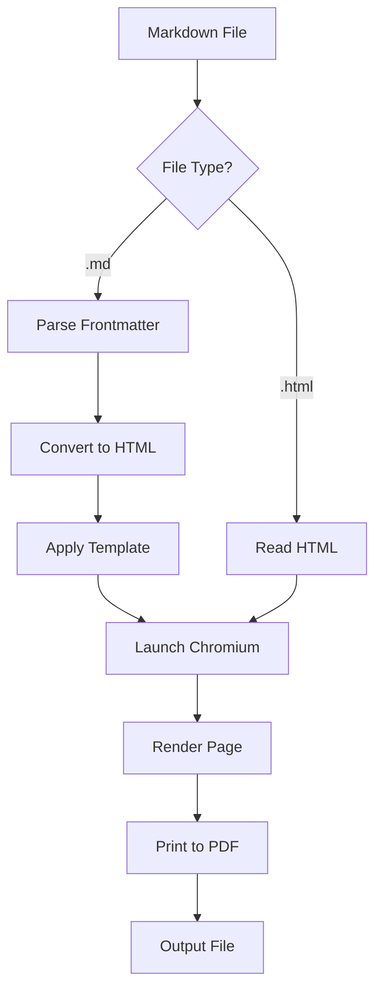
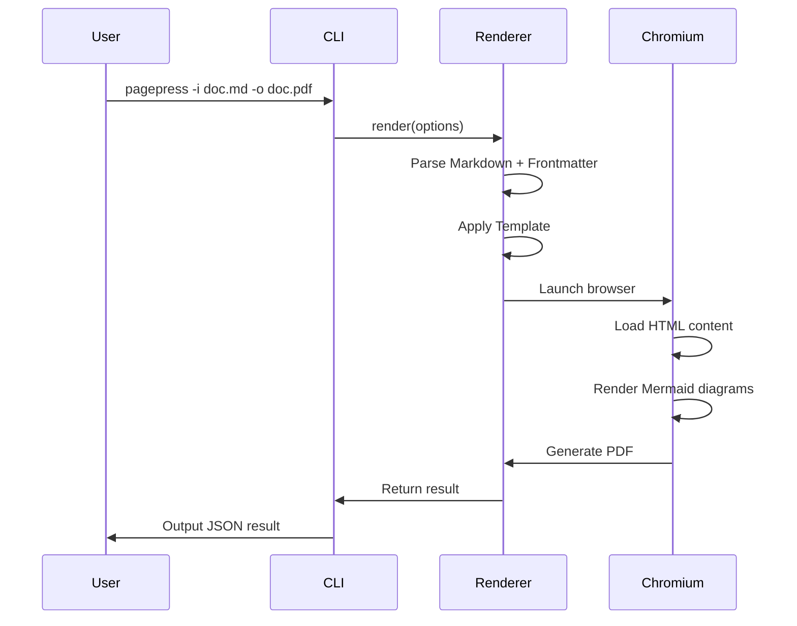

# PagePress Showcase

A comprehensive demonstration of every Markdown formatting feature supported by PagePress — from basic typography to advanced elements like tables, code blocks, and diagrams.

## Typography & Inline Formatting

Regular paragraph text flows naturally with comfortable line height and spacing. PagePress renders Markdown into clean, print-ready PDF documents using Playwright and Chromium.

You can use **bold text** for emphasis, *italic text* for nuance, and ***bold italic*** when both are needed. Inline `code` is rendered with a monospace font and subtle background. You can also use ~~strikethrough~~ for deleted content.

Links are styled with accent color: [PagePress on GitHub](https://github.com/liustack/pagepress). Autolinks work too: https://example.com.

---

## Headings Hierarchy

### Third-Level Heading

Use H3 for subsections within a major topic. The heading sizes decrease proportionally while maintaining visual hierarchy.

#### Fourth-Level Heading

H4 is useful for minor subsections or labeled paragraphs. It uses a secondary color to distinguish from higher-level headings.

---

## Lists

### Unordered List

- First item with some descriptive text
- Second item — supports inline **bold** and *italic*
  - Nested item level 2
  - Another nested item
    - Deeply nested item level 3
- Back to top level

### Ordered List

1. Clone the repository
2. Install dependencies with `pnpm install`
3. Install Chromium: `npx playwright install chromium`
4. Run the CLI:
   - Use `-i` for input file
   - Use `-o` for output path
   - Use `-t` to select a template

### Task List

- [x] Markdown parsing with frontmatter support
- [x] Three built-in templates (default, github, magazine)
- [x] Mermaid diagram rendering
- [x] Syntax highlighting via highlight.js
- [ ] Custom template support
- [ ] EPUB output format

---

## Blockquotes

> "Good design is as little design as possible."
> — Dieter Rams

Nested blockquotes:

> This is a first-level quote.
>
> > This is a nested quote inside the outer one.
> > It can span multiple lines.
>
> Back to the first level.

---

## Code Blocks

### JavaScript

```javascript
import { render } from './renderer.ts';

async function generateReport(data) {
  const markdown = `# Report\n\n${data.summary}`;

  // Write temp file and render
  const result = await render({
    input: 'report.md',
    output: 'report.pdf',
    template: 'default',
  });

  console.log(`PDF generated: ${result.pdfPath}`);
  return result;
}
```

### TypeScript

```typescript
interface PdfTemplate {
  name: string;
  description: string;
  file: string;
}

export function getTemplate(name: string): PdfTemplate {
  const template = templates[name];
  if (!template) {
    throw new Error(`Unknown template: ${name}`);
  }
  return template;
}
```

### Python

```python
from pathlib import Path
from dataclasses import dataclass

@dataclass
class Document:
    title: str
    content: str
    template: str = "default"

    def render(self) -> bytes:
        """Convert markdown content to PDF bytes."""
        html = markdown_to_html(self.content)
        return chromium_print(html, self.template)

documents = [
    Document("Q1 Report", report_md, "magazine"),
    Document("API Docs", api_md, "github"),
]

for doc in documents:
    Path(f"output/{doc.title}.pdf").write_bytes(doc.render())
```

### Shell

```bash
#!/usr/bin/env bash
set -euo pipefail

# Generate PDFs for all markdown files in docs/
for file in docs/*.md; do
  name=$(basename "$file" .md)
  pagepress -i "$file" -o "output/${name}.pdf" --template default
  echo "Generated: ${name}.pdf"
done
```

### CSS

```css
:root {
  --text-primary: #1d1d1f;
  --text-secondary: #6e6e73;
  --accent: #0071e3;
  --code-bg: #f5f5f7;
}

body {
  font-family: system-ui, -apple-system, sans-serif;
  font-size: 16px;
  line-height: 1.75;
  color: var(--text-primary);
}

@media print {
  .container { padding: 0; max-width: none; }
}
```

### JSON

```json
{
  "name": "@liustack/pagepress",
  "version": "0.7.0",
  "bin": { "pagepress": "./dist/main.js" },
  "scripts": {
    "build": "vite build",
    "test": "vitest run",
    "test:coverage": "vitest run --coverage"
  }
}
```

---

## Tables

### Simple Table

| Template | Style | Best For |
|----------|-------|----------|
| `default` | Clean minimalist | Technical docs, reports |
| `github` | GitHub-flavored | README-style documents |
| `magazine` | Premium editorial | Presentations, whitepapers |

### Alignment

| Feature | Status | Priority | Notes |
|:--------|:------:|:--------:|------:|
| Markdown input | ✅ | High | Core feature |
| HTML input | ✅ | High | Direct print |
| Mermaid diagrams | ✅ | Medium | Built-in |
| Safe mode | ✅ | Medium | Network isolation |
| Custom templates | 🚧 | Low | Planned |
| EPUB export | ❌ | Low | Future |

### Data Table

| Metric | v0.5 | v0.6 | v0.7 | Change |
|--------|------|------|------|--------|
| Build time | 1.2s | 0.8s | 0.4s | -66% |
| Bundle size | 18KB | 15KB | 13KB | -28% |
| Templates | 1 | 2 | 3 | +200% |
| Test coverage | 0% | 45% | 72% | +72% |

---

## Images

Images are centered with rounded corners:


---

## Mermaid Diagrams

### Flowchart



### Sequence Diagram



---

## Horizontal Rules

Content above the rule.

---

Content below the rule. Horizontal rules create visual separation between major sections.

---

## Mixed Content

Here's a paragraph that includes **bold**, *italic*, `inline code`, and a [link](https://example.com) all in one line. It demonstrates how inline formatting works together seamlessly.

> **Note:** You can combine blockquotes with other formatting. Inside a quote, you can use:
> - **Bold text** for emphasis
> - `code snippets` for technical terms
> - Even nested lists

After the blockquote, normal paragraph flow resumes. The spacing between different element types is carefully tuned to maintain visual rhythm without feeling cramped or too spread out.

### Final code example

```javascript
// Everything comes together
const result = await render({
  input: 'showcase.md',
  output: 'showcase.pdf',
  template: 'default', // or 'github', 'magazine'
});

console.log('✓ PDF generated successfully');
```

---

*Generated by [PagePress](https://github.com/liustack/pagepress) — CLI toolkit for AI agents to render Markdown and HTML into high-quality PDF documents.*
